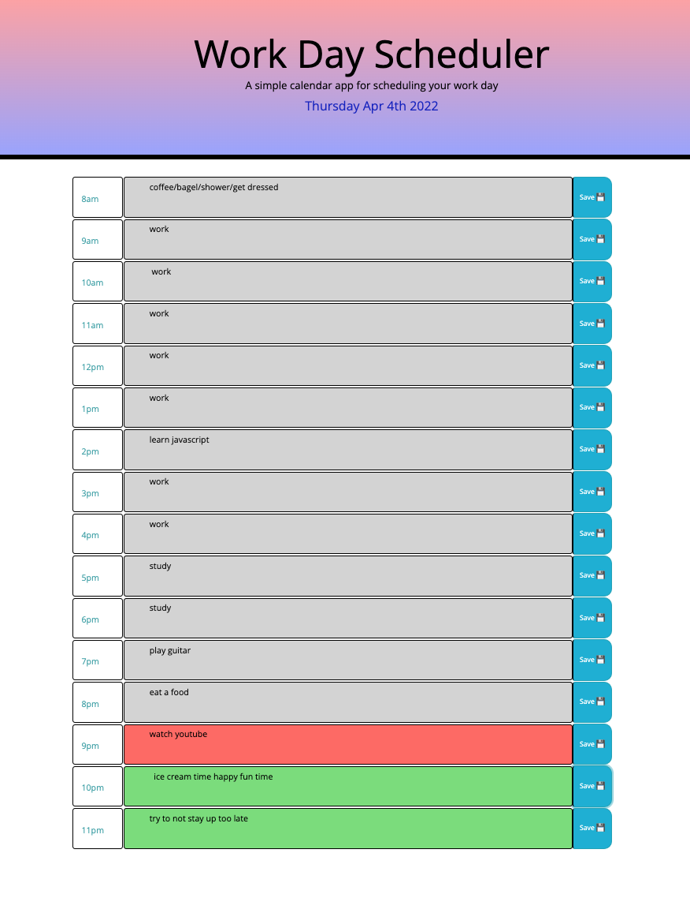

# Project Title

Use this site to plan your workday and utilize a time-based color coded system for observing the passage of time!

## Description

The user can input their daily tasks into the text fields and save using the save button on the right hand column. The user can observe the color coded system to visualize the hours of the day to make plans for how to approach upcoming deadlines.

## Screenshot

## deployed app link: https://jakelauterstein.github.io/Workday-Calendar-Challenge-5/

### Dependencies

* none

## Authors

Author: Jake Lauterstein with help from tutor 'AB'
jakelauterstein@gmail.com

## Version History

several commits building on basic functionality
one version only

      
       